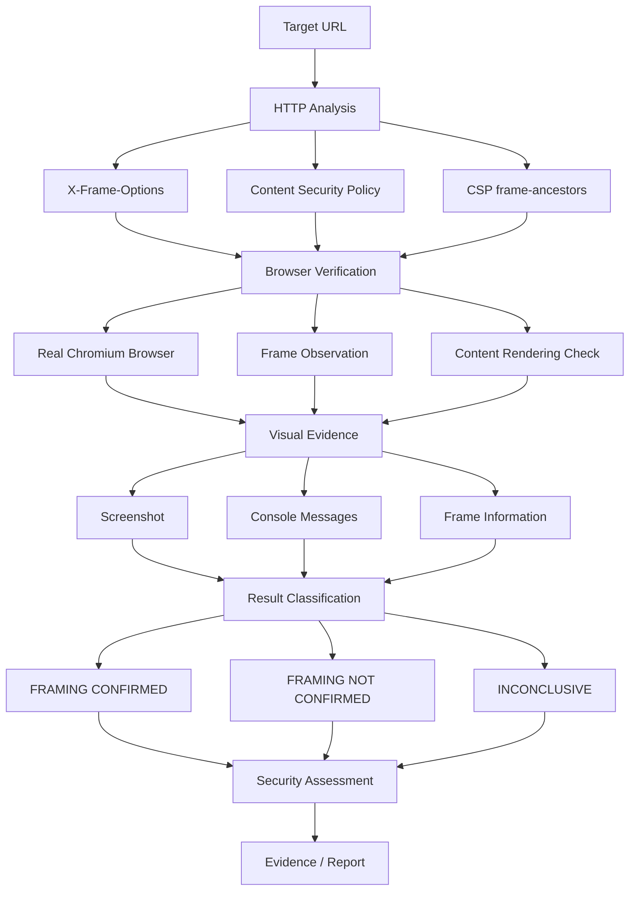

# FrameGuard

**FrameGuard** is a focused clickjacking and web framing verification tool for penetration testers, security researchers, and authorized security assessments.

It is designed to answer one specific question:

> **Can the target web application actually be framed and rendered inside an iframe?**

FrameGuard combines HTTP-level analysis with real browser-based verification and visual evidence.

It does **not** treat a missing security header alone as proof of a clickjacking vulnerability.

---

## What is FrameGuard?

Clickjacking protection can be implemented through multiple security controls, including:

- `X-Frame-Options`
- Content Security Policy
- CSP `frame-ancestors`
- Same-origin restrictions
- Browser-enforced framing behavior
- Application-level protections

A target may not return an `X-Frame-Options` header and still prevent successful framing through other mechanisms.

Similarly, the existence of an `<iframe>` element does not prove that the target application successfully rendered inside that frame.

FrameGuard therefore performs actual browser-based verification.

### Core approach

```text
HTTP Analysis
      ↓
Browser Verification
      ↓
Actual Frame Rendering
      ↓
Visual Evidence
      ↓
Result Classification
      ↓
Security Assessment
```

---

# Why FrameGuard?

Traditional header-only checks can produce misleading results.

For example:

```text
X-Frame-Options: Missing
```

does not automatically mean:

```text
Clickjacking: Confirmed
```

FrameGuard goes one step further and verifies browser behavior.

It checks whether the target content actually becomes available inside the frame and records supporting evidence.

This makes the tool useful for:

- Clickjacking verification
- UI redressing testing
- Security header validation
- Browser behavior analysis
- VAPT assessments
- Bug bounty research
- Security evidence collection

---

# Features

## HTTP Analysis

FrameGuard analyzes the target HTTP response for framing-related security controls.

It checks:

- HTTP status code
- Final URL
- `X-Frame-Options`
- Content Security Policy
- CSP `frame-ancestors`

The HTTP analysis provides supporting information for the browser verification.

---

## Browser Verification

FrameGuard uses a real Chromium browser through Playwright.

The browser-based test checks actual framing behavior rather than relying only on HTTP headers.

It observes:

- Frame attachment
- Target frame URL
- HTTP response status
- Page title
- Target content signals
- Browser console messages
- Rendering behavior
- Screenshots

The objective is to determine whether the target content actually rendered inside the frame.

---

# Result Classification

FrameGuard separates configuration observations from actual browser behavior.

## FRAMING CONFIRMED

The browser successfully confirms that target content rendered inside the frame.

## FRAMING NOT CONFIRMED

The browser test did not confirm that target content rendered inside the frame.

## INCONCLUSIVE

The automated test could not establish a reliable result and manual verification may be required.

This distinction helps avoid reporting a missing security header as a confirmed clickjacking vulnerability.

---

# Testing Workflow

FrameGuard follows a focused verification workflow.



### Verification principle

FrameGuard follows this principle:

**HTTP Controls → Browser Behavior → Actual Frame Rendering → Evidence → Result**

The browser result is therefore an important part of the verification process.

---

# Visual Test Matrix

FrameGuard provides a Visual Test Matrix for comparing multiple framing scenarios.

The matrix can test:

### Direct Cross-Origin

Attempts to frame the target from a different origin.

### Controlled Framing

Performs a controlled framing test for browser verification.

### Hostname Variant

Tests framing behavior using a hostname variation where applicable.

### Nested Frame

Tests the target through an additional framing layer.

### Redirect Final Target

Follows redirects and verifies the final destination rather than relying only on the initial URL.

Each test records relevant browser observations.

Evidence screenshots can be opened directly from the matrix.

---

# SAMEORIGIN Verification

FrameGuard includes a dedicated SAMEORIGIN verification workflow.

This helps determine whether same-origin framing behavior differs from cross-origin framing behavior.

The verification is performed through the browser instead of treating the HTTP header alone as proof of actual behavior.

---

# PoC Preview

FrameGuard can generate a controlled HTML framing Proof of Concept.

The PoC is intended for visual verification during authorized security testing.

### Workflow

```text
Generate Temporary PoC
        ↓
Open PoC in Browser
        ↓
Observe Framing Behavior
        ↓
Review Result
        ↓
Save Evidence or Discard
```

Temporary PoC files can be discarded when evidence is not required.

The PoC is non-destructive and does not attempt to capture credentials or perform actions on behalf of the target user.

---

# Evidence

FrameGuard is designed to make browser verification easier to document.

Depending on the test, evidence can include:

- Target URL
- Final URL
- HTTP status
- `X-Frame-Options`
- Content Security Policy
- CSP `frame-ancestors`
- Frame attachment state
- Target frame URL
- Page title
- Target content signal
- Browser console messages
- Test timestamp
- Screenshots
- Visual Test Matrix results

This information can be used as supporting evidence during an authorized penetration test or security assessment.

---

# Typical Usage

A typical assessment can be performed using the following workflow.

## Step 1 — Enter the Target

Enter the authorized target URL into FrameGuard.

Example:

```text
https://example.com
```

---

## Step 2 — Analyze

Run **Analyze**.

Review the framing-related HTTP controls:

```text
HTTP Status
Final URL
X-Frame-Options
Content-Security-Policy
frame-ancestors
```

---

## Step 3 — Browser Test

Run **Browser Test**.

FrameGuard launches Chromium and performs an actual browser-based framing test.

Review whether the target content was successfully rendered inside the frame.

---

## Step 4 — Visual Test Matrix

Use **Visual Test Matrix** when multiple framing scenarios need to be compared.

Review:

- Test status
- HTTP response
- Frame state
- Content signal
- Console information
- Screenshot evidence

---

## Step 5 — SAMEORIGIN Verification

Use **SAMEORIGIN Verification** when same-origin behavior needs to be examined separately.

---

## Step 6 — Preview PoC

Use **Preview PoC** when a controlled visual framing demonstration is useful.

Review the generated PoC in the browser before deciding whether to save evidence.

---

## Step 7 — Save Evidence

Save screenshots and relevant test information when evidence is required.

---

## Step 8 — Security Assessment

Use the observed browser behavior and supporting HTTP information when documenting the security assessment.

---

# Installation

## Requirements

FrameGuard requires:

- Python 3.10+
- Playwright
- Chromium
- Windows, Linux, or macOS

---

# Windows Installation

Open PowerShell.

### 1. Clone the repository

```powershell
git clone https://github.com/Katiyar-crypto/FrameGuard.git
```

### 2. Enter the project directory

```powershell
cd FrameGuard
```

### 3. Install Python dependencies

```powershell
py -m pip install -r requirements.txt
```

### 4. Install Chromium

```powershell
py -m playwright install chromium
```

### 5. Start FrameGuard

```powershell
py .\FrameGuard.py
```

---

# Linux / macOS Installation

### 1. Clone the repository

```bash
git clone https://github.com/Katiyar-crypto/FrameGuard.git
```

### 2. Enter the project directory

```bash
cd FrameGuard
```

### 3. Install dependencies

```bash
python3 -m pip install -r requirements.txt
```

### 4. Install Chromium

```bash
python3 -m playwright install chromium
```

### 5. Start FrameGuard

```bash
python3 FrameGuard.py
```

---

# Quick Start

For Windows:

```powershell
git clone https://github.com/Katiyar-crypto/FrameGuard.git
cd FrameGuard
py -m pip install -r requirements.txt
py -m playwright install chromium
py .\FrameGuard.py
```

For Linux/macOS:

```bash
git clone https://github.com/Katiyar-crypto/FrameGuard.git
cd FrameGuard
python3 -m pip install -r requirements.txt
python3 -m playwright install chromium
python3 FrameGuard.py
```

---

# Project Structure

```text
FrameGuard/
│
├── FrameGuard.py
├── README.md
├── requirements.txt
├── .gitignore
│
└── FrameGuard_Reports/
```

Generated reports and temporary artifacts are excluded from version control through `.gitignore`.

---

# Technology

FrameGuard uses:

- Python
- Tkinter
- Requests
- Playwright
- Chromium

### Python

Used for the application logic, HTTP analysis, evidence processing, and graphical interface.

### Tkinter

Provides the desktop graphical user interface.

### Requests

Used for HTTP-level analysis of the target.

### Playwright

Provides real browser-based verification.

### Chromium

Provides the browser environment used to test actual framing behavior.

---

# What FrameGuard Checks

FrameGuard focuses specifically on web framing and clickjacking-related behavior.

| Area | Verification |
|---|---|
| HTTP Status | Yes |
| Final URL | Yes |
| X-Frame-Options | Yes |
| Content-Security-Policy | Yes |
| CSP `frame-ancestors` | Yes |
| Browser Framing | Yes |
| Cross-Origin Framing | Yes |
| SAMEORIGIN Verification | Yes |
| Nested Framing | Yes |
| Redirect Handling | Yes |
| Screenshot Evidence | Yes |
| Visual Test Matrix | Yes |
| Controlled PoC | Yes |

---

# What FrameGuard Does Not Do

FrameGuard is intentionally focused and is not a general-purpose vulnerability scanner.

It does not attempt to replace tools such as:

- Burp Suite
- OWASP ZAP
- Nmap
- Nuclei
- Nikto
- Full web application security testing platforms

FrameGuard concentrates specifically on:

**Clickjacking + Web Framing + Browser Verification + Evidence**

---

# Why Browser Testing Matters

Consider the following HTTP response:

```text
HTTP/2 200 OK
```

with:

```text
X-Frame-Options: Not Present
```

A header-only scanner may flag this as a potential issue.

However, the actual browser behavior may still prevent the target from being successfully framed.

For example:

```text
HTTP Response
      │
      ▼
Security Headers
      │
      ▼
Browser Framing Attempt
      │
      ▼
Does Target Content Render?
      │
 ┌────┴────┐
 │         │
 YES       NO
 │         │
 ▼         ▼
Confirmed  Not Confirmed
```

FrameGuard uses this browser observation as an important part of the verification process.

---

# Evidence Interpretation

A confirmed framing result should be evaluated in the context of the application.

For a complete clickjacking assessment, consider:

- Whether the user is authenticated
- Whether sensitive actions are available
- Whether sensitive actions can be performed through the framed interface
- Whether additional confirmation is required
- Whether CSRF protections are present
- Whether user interaction is realistically achievable
- Whether the affected functionality is security-sensitive
- Whether the behavior falls within the authorized testing scope

A browser framing result and a complete vulnerability-impact assessment are related but distinct steps.

---

# Security Testing Philosophy

FrameGuard follows a simple principle:

> **Do not confuse a configuration observation with a confirmed security impact.**

Examples:

```text
Missing X-Frame-Options
        ≠
Confirmed Clickjacking
```

and:

```text
Iframe Element Exists
        ≠
Target Content Rendered
```

The purpose of FrameGuard is to make the actual browser behavior easier to verify.

---

# Use Cases

FrameGuard can be used for:

- Web application penetration testing
- Application security testing
- VAPT assessments
- Clickjacking assessments
- UI redressing testing
- Bug bounty research
- Security header validation
- Browser behavior analysis
- Security research
- Cybersecurity education
- Evidence collection

---

# Responsible Use

FrameGuard should only be used against systems that you own or have explicit authorization to test.

Do not use FrameGuard to:

- Access unauthorized systems
- Capture credentials
- Capture sensitive user information
- Bypass authentication
- Perform destructive actions
- Modify target applications
- Interfere with production services
- Test systems outside the authorized scope

When testing third-party applications, follow the applicable:

- Security testing policy
- Bug bounty rules
- Responsible disclosure policy
- Written authorization
- Testing scope

---

# Privacy and Evidence Handling

Security testing evidence can contain sensitive information.

Before sharing screenshots, reports, or test results publicly:

- Remove credentials
- Remove session tokens
- Remove API keys
- Remove personal information
- Remove internal hostnames
- Remove confidential application data
- Review screenshots for sensitive information

Do not upload client evidence or private assessment data to a public repository.

---

# Contributing

Contributions are welcome.

When submitting an issue or pull request, provide:

- A clear description of the issue
- Steps to reproduce
- Expected behavior
- Observed behavior
- Relevant logs
- Browser information
- Screenshots where useful

Do not include:

- Passwords
- API keys
- Session tokens
- Personal information
- Confidential client information

---

# Disclaimer

FrameGuard is provided for authorized security testing, research, and educational purposes.

A detected framing condition does not automatically establish that an application has a complete clickjacking vulnerability or a specific business impact.

Security findings should be validated against the actual application behavior, affected functionality, authentication state, user interaction requirements, and applicable security controls.

The user is responsible for ensuring that all security testing is properly authorized.

---

# License

See the repository license for the terms governing use and distribution.

---

## FrameGuard

**Focused clickjacking verification for authorized security testing.**